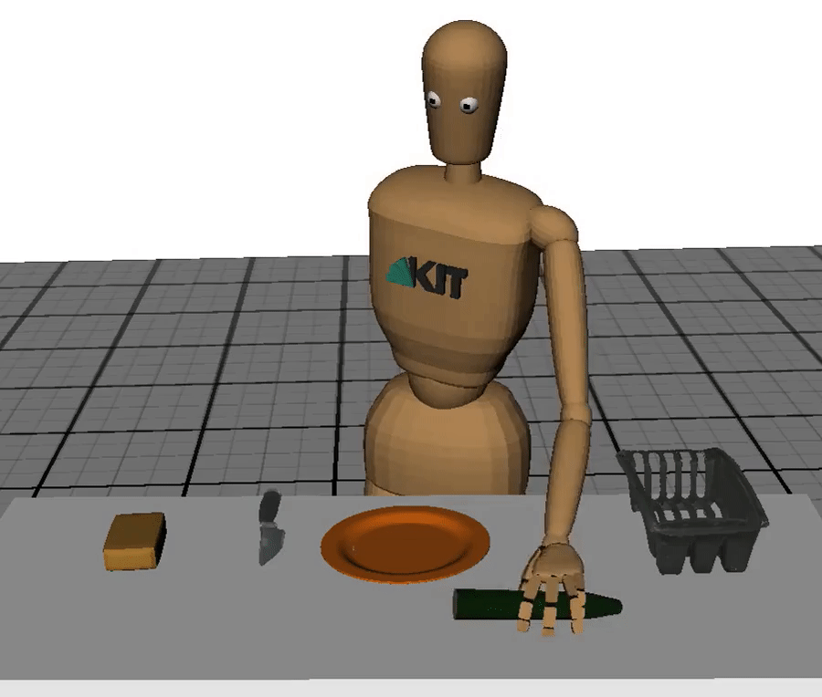
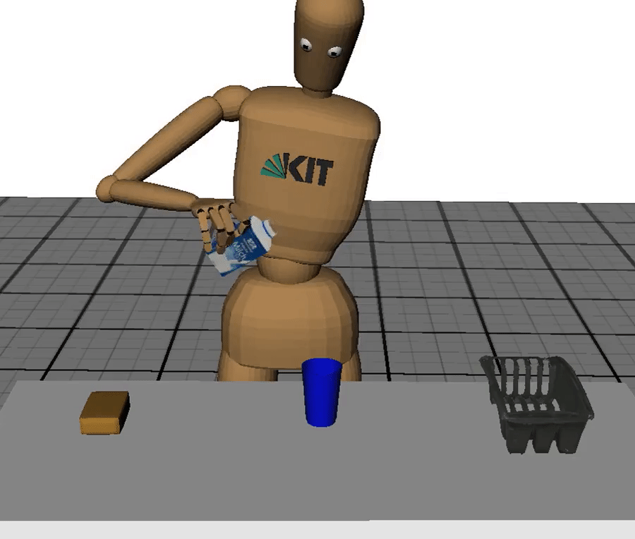

# Action-Conditioned-Generation-of-Bimanual-Object-Manipulation

We present a novel method for forecasting bimanual object manipulation sequences from unimanual observations. Published at AAAI 2024.

# Contents
------------
  * [Requirements](#requirements)
  * [Brief Project Structure](#brief-project-structure)
  * [Results](#results)
  * [Visualization](#visualization)
  * [Training](#training)
  * [Testing](#testing)
  * [References](#references)

# Requirements
------------
 
For visualization

  * Ubuntu 18.04 (for the Master Motor Map)
  * [Master Motor Map](https://mmm.humanoids.kit.edu/mmm2-2-installation.html) 
  
For training and testing

  * Ubuntu 18.04 / Ubuntu 20.04
  * PyTorch
  * PyTorch Geometric
  * anaconda
  * configobj

# Brief Project Structure
------------

    ├── args          : directory containing the argparser
    ├── dataloaders   : directory containing the dataloader script
    ├── datasets      : directory containing the data and the scripts to visualize the output
    ├── experiments   : directory containing the shell scripts that run the train and test scripts
    ├── misc          : directory containing the loss computations, and checkpointing scripts
    ├── models        : directory containing the model architecture
    ├── results       : directory containing some sample results
    ├── weights       : directory containing the model weights
    ├── paper.pdf     : AAAI paper
    ├── test.py       : test script
    ├── train.py      : train script
    
# Results
------------

  
   <br>
&nbsp;&nbsp;&nbsp;&nbsp;&nbsp;&nbsp;&nbsp;&nbsp;&nbsp;&nbsp;&nbsp;&nbsp;&nbsp;&nbsp;&nbsp;&nbsp;Ground Truth&nbsp;&nbsp;&nbsp;&nbsp;&nbsp;&nbsp;&nbsp;&nbsp;&nbsp;&nbsp;&nbsp;&nbsp;&nbsp;&nbsp;&nbsp;&nbsp;&nbsp;&nbsp;&nbsp;&nbsp;&nbsp;&nbsp;&nbsp;&nbsp;&nbsp;&nbsp;&nbsp;&nbsp;&nbsp;&nbsp;&nbsp;&nbsp;&nbsp;&nbsp;&nbsp;&nbsp;&nbsp;&nbsp;&nbsp;&nbsp;&nbsp;&nbsp;&nbsp;Input&nbsp;&nbsp;&nbsp;&nbsp;&nbsp;&nbsp;&nbsp;&nbsp;&nbsp;&nbsp;&nbsp;&nbsp;&nbsp;&nbsp;&nbsp;&nbsp;&nbsp;&nbsp;&nbsp;&nbsp;&nbsp;&nbsp;&nbsp;&nbsp;&nbsp;&nbsp;&nbsp;&nbsp;&nbsp;&nbsp;&nbsp;&nbsp;&nbsp;&nbsp;&nbsp;&nbsp;&nbsp;&nbsp;&nbsp;&nbsp;&nbsp;&nbsp;&nbsp;&nbsp;&nbsp;&nbsp;&nbsp;&nbsp;&nbsp;&nbsp;Output

# Visualization
------------

  * To visualize a sample output as shown above, clone the repository and run the following commands.

```
cd ./datasets/kit_mocap/my_scripts/result_processing
python convert_to_mmm.py \
    --result_root "~/Forecasting-Bimanual-Object-Manipulation-Sequences-From-Unimanual-Observations/results/" \
    --result_name "unimanual2bimanual/kit_mocap/joint/"
./results/unimanual2bimanual/kit_mocap/joint/convert.sh
```

  * The commands above process the model's sample outputs in `./results/unimanual2bimanual/kit_mocap/joint` into a format viewable via the Master Motor Map. The processed files will be stored in `./datasets/my_scripts/result_processing/results/unimanual2bimanual/joint/`.

```
~/MMMTools/build/bin/MMMViewer
```

  * The command above launches the viewer. The processed files in `./datasets/my_scripts/result_processing/results/unimanual2bimanual/kit_mocap/generation/combined` can then be selected for vizualization. The results can also be visualized as point clouds if MMM has not been installed.

# Training
------------

  * To train a model, download the [processed data](https://imperialcollegelondon.box.com/s/dj09swpbcq5e0qoztja1mc86eoxes4wr) then unzip it to `./data` as shown in [Brief Project Structure](#brief-project-structure) and run the following commands.

```
cd ./experiments/unimanual2bimanual
CUDA_VISIBLE_DEVICES=0 \
    python "$HOME/Forecasting-Bimanual-Object-Manipulation-Sequences-From-Unimanual-Observations/train.py" \
    --args="args.unimanual2bimanual" \
    --config_file="kit_mocap/joint.ini"
```

# Testing
------------

  * To test the model, run the following commands:

```
cd ./experiments/unimanual2bimanual
CUDA_VISIBLE_DEVICES=0 \
    python "$HOME/Forecasting-Bimanual-Object-Manipulation-Sequences-From-Unimanual-Observations/test.py" \
    --args="args.unimanual2bimanual" \
    --config_file="kit_mocap/joint.ini" \
    batch_size=2 teacher_force_ratio=0.0
```

  * The outputs will then be stored in `./results` that can be visualized by following the instructions listed in [Visualization](#visualization).

# References
------------
```
@inproceedings{krebs2021kit,
  title={The KIT Bimanual Manipulation Dataset},
  author={Krebs, Franziska and Meixner, Andre and Patzer, Isabel and Asfour, Tamim},
  booktitle={2020 IEEE-RAS 20th International Conference on Humanoid Robots (Humanoids)},
  pages={499--506},
  year={2021},
  organization={IEEE}
}
```
```
@article{dreher2019learning,
  title={Learning object-action relations from bimanual human demonstration using graph networks},
  author={Dreher, Christian RG and W{\"a}chter, Mirko and Asfour, Tamim},
  journal={IEEE Robotics and Automation Letters},
  volume={5},
  number={1},
  pages={187--194},
  year={2019},
  publisher={IEEE}
}
```
